# Food Vision API

Backend FastAPI para análise estruturada de imagens de alimentos com a OpenAI.
A API recebe uma imagem de um prato, prepara o arquivo para análise multimodal e
retorna informações sobre componentes, ingredientes, porções, calorias e
nutrientes.

## Arquitetura

O backend utiliza uma arquitetura em camadas, com responsabilidades separadas:

- **API:** define os endpoints, valida os parâmetros HTTP e fecha os uploads.
- **Services:** orquestra o processamento da imagem e a análise nutricional.
- **Integrations:** encapsula o cliente e a Responses API da OpenAI.
- **Schemas:** define e valida o contrato público da resposta.
- **Core:** centraliza configurações, logging e exceções da aplicação.
- **Dependencies:** constrói e reutiliza os serviços usados pelo FastAPI.

```text
backend/
├── app/
│   ├── main.py                         # FastAPI, CORS, routers e lifespan
│   ├── api/
│   │   ├── router.py                   # Agregação das rotas versionadas
│   │   └── routes/
│   │       ├── food_analysis.py        # POST /api/v1/food-analysis
│   │       └── health.py               # GET /health
│   ├── core/
│   │   ├── config.py                   # Settings e leitura do .env
│   │   ├── exceptions.py               # Erros e handler global
│   │   └── logging.py                  # Configuração de logs
│   ├── dependencies/
│   │   └── services.py                 # Injeção e lifecycle dos serviços
│   ├── integrations/
│   │   └── openai/
│   │       ├── client.py               # Construção do AsyncOpenAI
│   │       ├── food_analyzer.py        # Responses API e Structured Outputs
│   │       └── prompts.py              # Prompt de análise alimentar
│   ├── schemas/
│   │   └── food_analysis.py            # Modelos Pydantic da resposta
│   └── services/
│       ├── food_analysis_service.py    # Orquestração do caso de uso
│       └── image_preprocessor.py       # Validação e preparação da imagem
└── tests/
    ├── integration/                    # Endpoints e dependency overrides
    └── unit/                           # Config, schemas, imagem e OpenAI
```

### Dependências entre camadas

```mermaid
flowchart LR
    Client["Cliente web ou desktop"]
    API["Rotas FastAPI"]
    Service["FoodAnalysisService"]
    Image["ImagePreprocessor"]
    Analyzer["OpenAIFoodAnalyzer"]
    OpenAI["OpenAI Responses API"]
    Schema["FoodAnalysis (Pydantic)"]

    Client -->|multipart image| API
    API --> Service
    Service --> Image
    Image -->|PreparedImage| Analyzer
    Analyzer -->|responses.parse| OpenAI
    OpenAI -->|Structured Output| Schema
    Schema --> API
    API -->|JSON| Client
```



## Fluxo de análise

1. O cliente envia `multipart/form-data` com o campo `image`.
2. A rota obtém o `FoodAnalysisService` por injeção de dependência.
3. O `ImagePreprocessor` valida o MIME declarado e lê no máximo o limite
   configurado mais um byte.
4. O Pillow verifica o conteúdo e confirma que o formato real é JPEG, PNG ou
   WebP.
5. A orientação EXIF é aplicada, a imagem é convertida para RGB e redimensionada
   com proporção preservada.
6. O resultado é convertido para JPEG e codificado como
   `data:image/jpeg;base64,...`.
7. O `OpenAIFoodAnalyzer` chama `AsyncOpenAI.responses.parse` com texto, imagem e
   o schema `FoodAnalysis`.
8. A saída estruturada é validada pelo Pydantic, incluindo valores não negativos,
   finitude numérica e coerência da faixa calórica.
9. A rota devolve o JSON validado e fecha o `UploadFile`.

Erros de upload, processamento, configuração e comunicação externa são
convertidos pelo handler global em respostas seguras e consistentes. A chave da
OpenAI e o conteúdo Base64 não são registrados nos logs.

O cliente `AsyncOpenAI` é reutilizado durante a execução da aplicação e fechado
no shutdown pelo lifespan do FastAPI.

## Endpoints

### Health check

```http
GET /health
```

Resposta:

```json
{
  "status": "ok"
}
```

### Análise de alimento

```http
POST /api/v1/food-analysis
Content-Type: multipart/form-data
```

Campo obrigatório:

| Campo | Tipo | Descrição |
| --- | --- | --- |
| `image` | arquivo | Imagem JPEG, PNG ou WebP do prato |

Exemplo:

```powershell
curl.exe -X POST "http://localhost:8000/api/v1/food-analysis" `
  -F "image=@C:\caminho\prato.jpg"
```

A resposta segue o schema `FoodAnalysis`, com:

- identificação e descrição do prato;
- componentes e ingredientes visíveis ou inferidos;
- porções, pesos e calorias estimadas;
- estimativa de nutrientes;
- faixa calórica total;
- confiança, suposições, avisos e perguntas de confirmação.

## Configuração

As configurações são carregadas de `backend/.env` por `pydantic-settings`.

```powershell
Copy-Item .env.example .env
```

Variáveis disponíveis:

| Variável | Padrão | Finalidade |
| --- | --- | --- |
| `OPENAI_API_KEY` | obrigatório para análise | Chave da API da OpenAI |
| `OPENAI_VISION_MODEL` | `gpt-4o-mini` | Modelo multimodal |
| `OPENAI_TIMEOUT_SECONDS` | `30` | Timeout das requisições |
| `OPENAI_MAX_RETRIES` | `2` | Tentativas automáticas do SDK |
| `MAX_IMAGE_SIZE_MB` | `10` | Limite do upload |
| `MAX_IMAGE_DIMENSION` | `1600` | Maior dimensão após resize |
| `CORS_ORIGINS` | `http://localhost:3000` | Origens separadas por vírgula |
| `API_V1_PREFIX` | `/api/v1` | Prefixo das rotas versionadas |
| `LOG_LEVEL` | `INFO` | Nível de logging |
| `ENVIRONMENT` | `development` | Ambiente da aplicação |

Nunca versione o arquivo `.env`.

## Execução local

Requisitos:

- Python 3.11 ou superior;
- `uv`;
- chave válida da OpenAI para o endpoint de análise.

```powershell
cd backend
uv sync --all-groups
uv run uvicorn app.main:app --reload
```

Documentação interativa:

- Swagger UI: `http://localhost:8000/docs`
- OpenAPI: `http://localhost:8000/openapi.json`

## Tratamento de erros

| Status | Situação |
| --- | --- |
| `413` | Arquivo acima do limite |
| `415` | Tipo ou formato não suportado |
| `422` | Arquivo vazio, corrompido ou imagem inválida |
| `502` | Resposta inválida ou erro da OpenAI |
| `503` | OpenAI indisponível ou serviço sem configuração |

## Qualidade

```powershell
uv run ruff check .
uv run ruff format --check .
uv run mypy app
uv run pytest
```

Os testes automatizados não realizam chamadas reais à OpenAI. A integração é
validada com mocks e dependency overrides.
