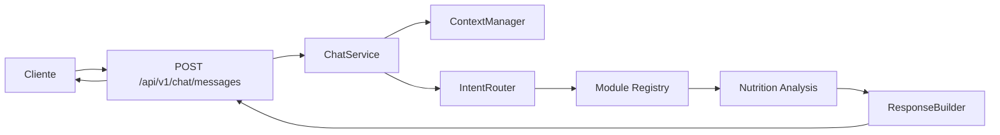

# Food Vision API

Backend FastAPI modular para análise estruturada de imagens de alimentos com a
OpenAI. A API oferece uma camada central de chat e mantém o endpoint nutricional
original para compatibilidade.

## Arquitetura

O backend separa transporte HTTP, orquestração de conversa, módulos de negócio e
infraestrutura compartilhada:

- **API:** versiona e agrega as rotas em `api/v1`; o health check permanece fora
  do prefixo versionado.
- **Chat:** identifica a intenção, consulta o contexto, executa somente módulos
  registrados e constrói uma resposta uniforme.
- **Modules:** isola funcionalidades de negócio. Apenas
  `nutrition_analysis` está implementado.
- **Integrations:** centraliza a criação e o lifecycle do cliente OpenAI.
- **Services:** mantém utilitários compartilhados, como o preprocessamento de
  imagens.
- **Core e dependencies:** concentram configuração, erros, logging e composição
  explícita dos serviços.

```text
backend/
├── app/
│   ├── main.py                         # FastAPI, CORS, routers e lifespan
│   ├── api/
│   │   └── v1/
│   │       ├── router.py               # Agregação das rotas versionadas
│   │       └── routes/
│   │           ├── chat.py             # POST /api/v1/chat/messages
│   │           ├── food_analysis.py    # Endpoint compatível
│   │           └── health.py           # GET /health
│   ├── chat/
│   │   ├── schemas.py                  # Contratos unificados
│   │   ├── service.py                  # Orquestração central
│   │   ├── intent_router.py            # Classificação determinística
│   │   ├── context_manager.py          # Contexto limitado em memória
│   │   └── response_builder.py         # Construção da resposta pública
│   ├── modules/
│   │   ├── nutrition_analysis/
│   │   │   ├── schemas.py              # Contrato nutricional preservado
│   │   │   ├── service.py              # Caso de uso e adaptador do chat
│   │   │   ├── analyzer.py             # Responses API
│   │   │   └── prompts.py              # Prompt nutricional
│   │   ├── food_identification/        # Pacote vazio
│   │   ├── allergen_analysis/          # Pacote vazio
│   │   ├── meal_comparison/            # Pacote vazio
│   │   └── knowledge_rag/              # Pacote vazio
│   ├── core/
│   │   ├── config.py                   # Settings e leitura do .env
│   │   ├── exceptions.py               # Erros e handler global
│   │   └── logging.py                  # Configuração de logs
│   ├── dependencies/
│   │   └── services.py                 # Injeção e lifecycle dos serviços
│   ├── integrations/
│   │   └── openai/
│   │       ├── client.py               # Construção do AsyncOpenAI
│   └── services/
│       └── image_preprocessor.py       # Validação e preparação da imagem
└── tests/
    ├── integration/                    # Endpoints sem OpenAI real
    └── unit/                           # Chat, módulo e infraestrutura
```

### Fluxo do chat



O `ChatService` valida a entrada, preserva ou cria o `conversation_id`, recupera
o contexto, solicita a classificação ao `IntentRouter`, consulta o registro
explícito de módulos e executa somente o módulo disponível. Ele não acessa a
OpenAI nem processa imagens diretamente.

O `IntentRouter` usa regras determinísticas, sem chamada adicional a modelos. O
registro contém apenas `nutrition_analysis`; solicitações reconhecidas para
módulos futuros recebem `module: "unavailable"` e nunca executam os pacotes
vazios.

O `ContextManager` mantém um histórico limitado apenas em memória. Imagens,
Base64, uploads, clientes e chaves não são armazenados. Todo contexto é perdido
quando a aplicação reinicia.

### Módulos

| Módulo | Status | Registrado no chat |
| --- | --- | --- |
| `nutrition_analysis` | Implementado | Sim |
| `food_identification` | Estrutura vazia | Não |
| `allergen_analysis` | Estrutura vazia | Não |
| `meal_comparison` | Estrutura vazia | Não |
| `knowledge_rag` | Estrutura vazia | Não |

RAG, fine-tuning, autenticação, banco de dados, Redis e persistência de histórico
não estão implementados.

### Fluxo nutricional

1. O cliente envia `multipart/form-data` com o campo `image`.
2. A rota compatível ou o adaptador do chat reutiliza o mesmo
   `FoodAnalysisService`.
3. O `ImagePreprocessor` valida o MIME declarado e lê no máximo o limite
   configurado mais um byte.
4. O Pillow verifica o conteúdo e confirma que o formato real é JPEG, PNG ou
   WebP.
5. A orientação EXIF é aplicada, a imagem é convertida para RGB e redimensionada
   com proporção preservada.
6. O resultado é convertido para JPEG e codificado como
   `data:image/jpeg;base64,...`.
7. O `OpenAIFoodAnalyzer` chama `AsyncOpenAI.responses.parse` com texto, imagem e
   o schema `FoodAnalysis`.
8. A saída estruturada é validada pelo Pydantic, incluindo valores não negativos,
   finitude numérica e coerência da faixa calórica.
9. A rota devolve o JSON validado e fecha o `UploadFile`. No chat, o resultado
   nutricional fica em `data` e o texto é derivado desse mesmo resultado, sem
   segunda chamada à OpenAI.

Erros de upload, processamento, configuração e comunicação externa são
convertidos pelo handler global em respostas seguras e consistentes. A chave da
OpenAI e o conteúdo Base64 não são registrados nos logs.

O cliente `AsyncOpenAI` é reutilizado durante a execução da aplicação e fechado
no shutdown pelo lifespan do FastAPI.

## Endpoints

### Health check

```http
GET /health
```

Resposta:

```json
{
  "status": "ok"
}
```

### Chat

```http
POST /api/v1/chat/messages
Content-Type: multipart/form-data
```

| Campo | Tipo | Obrigatório |
| --- | --- | --- |
| `message` | string | Não, quando uma imagem for enviada |
| `image` | arquivo | Não, quando uma mensagem for enviada |
| `conversation_id` | string | Não |

Pelo menos `message` ou `image` deve ser informado. A resposta sempre usa o
contrato `ChatResponse`, com `conversation_id`, `message_id`, `role`, `answer`,
`intent`, `module`, `data` e `suggested_actions`.

```powershell
curl.exe -X POST "http://localhost:8000/api/v1/chat/messages" `
  -F "message=Quantas calorias tem este prato?" `
  -F "image=@C:\caminho\prato.jpg"
```

### Análise de alimento compatível

```http
POST /api/v1/food-analysis
Content-Type: multipart/form-data
```

Campo obrigatório:

| Campo | Tipo | Descrição |
| --- | --- | --- |
| `image` | arquivo | Imagem JPEG, PNG ou WebP do prato |

Exemplo:

```powershell
curl.exe -X POST "http://localhost:8000/api/v1/food-analysis" `
  -F "image=@C:\caminho\prato.jpg"
```

Este endpoint foi preservado sem alteração de contrato. A resposta segue o
schema `FoodAnalysis`, com:

- identificação e descrição do prato;
- componentes e ingredientes visíveis ou inferidos;
- porções, pesos e calorias estimadas;
- estimativa de nutrientes;
- faixa calórica total;
- confiança, suposições, avisos e perguntas de confirmação.

## Configuração

As configurações são carregadas de `backend/.env` por `pydantic-settings`.

```powershell
Copy-Item .env.example .env
```

Variáveis disponíveis:

| Variável | Padrão | Finalidade |
| --- | --- | --- |
| `OPENAI_API_KEY` | obrigatório para análise | Chave da API da OpenAI |
| `OPENAI_VISION_MODEL` | `gpt-4o-mini` | Modelo multimodal |
| `OPENAI_TIMEOUT_SECONDS` | `30` | Timeout das requisições |
| `OPENAI_MAX_RETRIES` | `2` | Tentativas automáticas do SDK |
| `MAX_IMAGE_SIZE_MB` | `10` | Limite do upload |
| `MAX_IMAGE_DIMENSION` | `1600` | Maior dimensão após resize |
| `CORS_ORIGINS` | `http://localhost:3000` | Origens separadas por vírgula |
| `API_V1_PREFIX` | `/api/v1` | Prefixo das rotas versionadas |
| `LOG_LEVEL` | `INFO` | Nível de logging |
| `ENVIRONMENT` | `development` | Ambiente da aplicação |

Nunca versione o arquivo `.env`.

## Execução local

Requisitos:

- Python 3.11 ou superior;
- `uv`;
- chave válida da OpenAI para o endpoint de análise.

```powershell
cd backend
uv sync --all-groups
uv run uvicorn app.main:app --reload
```

Documentação interativa:

- Swagger UI: `http://localhost:8000/docs`
- OpenAPI: `http://localhost:8000/openapi.json`

## Tratamento de erros

| Status | Situação |
| --- | --- |
| `413` | Arquivo acima do limite |
| `415` | Tipo ou formato não suportado |
| `422` | Arquivo vazio, corrompido ou imagem inválida |
| `502` | Resposta inválida ou erro da OpenAI |
| `503` | OpenAI indisponível ou serviço sem configuração |

## Qualidade

```powershell
uv run ruff check .
uv run ruff format --check .
uv run mypy app
uv run pytest
```

Os testes automatizados não realizam chamadas reais à OpenAI. A integração é
validada com mocks e dependency overrides.
