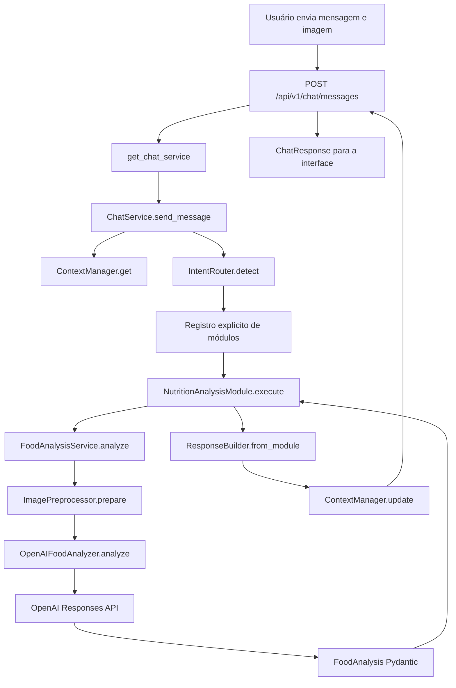

# Fluxo do chat e guia de implementação de módulos

Este documento descreve o backend como ele existe hoje e orienta a evolução
manual de novos módulos. Trechos marcados como **planejados** são propostas de
implementação, não funcionalidades disponíveis.

## 1. Introdução

O Food Vision API é um backend FastAPI que recebe imagens de refeições e devolve
uma análise nutricional estruturada. A integração usa o SDK assíncrono da OpenAI,
entrada multimodal e Structured Outputs validados por modelos Pydantic.

O endpoint único de chat oferece ao frontend um contrato estável para diferentes
intenções. Internamente, um registro explícito relaciona cada intenção a um
módulo funcional. Essa separação permite acrescentar capacidades sem colocar
regras de negócio nas rotas HTTP nem alterar o contrato `ChatResponse`.

Estado atual:

| Capacidade | Estado |
| --- | --- |
| Análise nutricional por imagem | Implementada |
| Contexto de conversa | Mantido apenas em memória |
| Persistência de conversas | Ainda não implementada |
| RAG | Planejado, ainda não implementado |
| Fine-tuning | Planejado, ainda não implementado |

RAG e fine-tuning podem ser incorporados no futuro como implementações
especializadas atrás do mesmo contrato de módulo. Essa possibilidade
arquitetural não significa que essas funcionalidades estejam disponíveis hoje.

## 2. Visão geral da arquitetura

Árvore real relevante:

```text
backend/
├── app/
│   ├── main.py
│   ├── api/
│   │   └── v1/
│   │       ├── router.py
│   │       └── routes/
│   │           ├── chat.py
│   │           ├── food_analysis.py
│   │           └── health.py
│   ├── chat/
│   │   ├── schemas.py
│   │   ├── service.py
│   │   ├── intent_router.py
│   │   ├── context_manager.py
│   │   └── response_builder.py
│   ├── modules/
│   │   ├── nutrition_analysis/
│   │   │   ├── schemas.py
│   │   │   ├── service.py
│   │   │   ├── analyzer.py
│   │   │   └── prompts.py
│   │   ├── food_identification/
│   │   ├── allergen_analysis/
│   │   ├── meal_comparison/
│   │   └── knowledge_rag/
│   ├── integrations/
│   │   └── openai/
│   │       └── client.py
│   ├── services/
│   │   └── image_preprocessor.py
│   ├── dependencies/
│   │   └── services.py
│   └── core/
│       ├── config.py
│       ├── exceptions.py
│       └── logging.py
└── tests/
    ├── integration/
    │   ├── test_chat_endpoint.py
    │   └── test_food_analysis_endpoint.py
    └── unit/
        ├── test_chat_service.py
        ├── test_context_manager.py
        ├── test_food_analysis_service.py
        ├── test_image_preprocessor.py
        ├── test_intent_router.py
        ├── test_openai_food_analyzer.py
        ├── test_response_builder.py
        └── test_schemas.py
```

Os diretórios de módulos futuros contêm somente `__init__.py` vazio.

| Pasta | Responsabilidade |
| --- | --- |
| `app/api` | Entrada HTTP, contratos de transporte e registro de rotas |
| `app/chat` | Orquestração da conversa e contrato comum dos módulos |
| `app/modules` | Casos de uso e integrações específicas de cada domínio |
| `app/integrations` | Construção de clientes externos compartilhados |
| `app/services` | Serviços reutilizáveis por mais de um módulo |
| `app/dependencies` | Construção, cache e encerramento dos objetos |
| `app/core` | Configuração, logging e exceções centrais |
| `tests` | Testes unitários e de integração sem chamadas reais à OpenAI |

## 3. Fluxo completo da aplicação

Exemplo de entrada:

```text
Usuário envia uma imagem e pergunta:
"Quantas calorias existem neste prato?"
```

Sequência real:

| Ordem | Arquivo | Função ou classe | Responsabilidade |
| ---: | --- | --- | --- |
| 1 | `app/main.py` | `create_app` | Configura e instancia o FastAPI |
| 2 | `app/api/v1/router.py` | `api_v1_router` | Agrega chat e endpoint compatível |
| 3 | `app/api/v1/routes/chat.py` | `send_chat_message` | Recebe formulário e fecha o upload |
| 4 | `app/dependencies/services.py` | `get_chat_service` | Resolve o grafo de dependências |
| 5 | `app/chat/service.py` | `ChatService.send_message` | Valida e orquestra a interação |
| 6 | `app/chat/context_manager.py` | `ContextManager.get` | Recupera ou cria o contexto |
| 7 | `app/chat/intent_router.py` | `IntentRouter.detect` | Classifica a intenção |
| 8 | `app/chat/service.py` | registro `modules` | Seleciona implementação registrada |
| 9 | `app/modules/nutrition_analysis/service.py` | `NutritionAnalysisModule.execute` | Adapta o caso nutricional ao chat |
| 10 | mesmo arquivo | `FoodAnalysisService.analyze` | Coordena imagem e analyzer |
| 11 | `app/services/image_preprocessor.py` | `ImagePreprocessor.prepare` | Valida e prepara a imagem |
| 12 | `app/modules/nutrition_analysis/analyzer.py` | `OpenAIFoodAnalyzer.analyze` | Chama `responses.parse` |
| 13 | `app/modules/nutrition_analysis/schemas.py` | `FoodAnalysis` | Valida o Structured Output |
| 14 | `app/chat/response_builder.py` | `ResponseBuilder.from_module` | Constrói `ChatResponse` |
| 15 | `app/chat/context_manager.py` | `ContextManager.update` | Atualiza histórico e estado seguro |
| 16 | `app/api/v1/routes/chat.py` | retorno da rota | Serializa a resposta e fecha o arquivo |

Não há uma segunda chamada à OpenAI para gerar `answer`. O adaptador deriva esse
texto dos dados já validados em `FoodAnalysis`.

## 4. Diagrama do fluxo



## 5. Inicialização da aplicação

O comando:

```powershell
# Inicia o servidor de desenvolvimento e recarrega após alterações.
uv run uvicorn app.main:app --reload
```

importa `app.main`. Durante o import, `app = create_app()`:

1. obtém `Settings` por `get_settings`;
2. configura logging com `configure_logging`;
3. cria a instância `FastAPI`;
4. registra o handler de `ApplicationError`;
5. adiciona o middleware CORS;
6. registra `health_router` sem prefixo;
7. registra `api_v1_router` com o prefixo configurado;
8. associa o lifespan.

O startup do lifespan apenas registra o início. Os objetos são criados sob
demanda pelas factories com `@lru_cache`. Isso inclui o `AsyncOpenAI`; portanto,
o cliente não é aberto antecipadamente apenas por iniciar a aplicação.

No shutdown, `close_services` limpa o contexto, fecha o cliente OpenAI caso tenha
sido criado e limpa os caches das factories. Swagger UI e OpenAPI permanecem nos
caminhos padrão `/docs` e `/openapi.json`. O health check é `GET /health`.

## 6. Versionamento das rotas

`app/api/v1/router.py` agrega somente os routers versionados:

```python
from fastapi import APIRouter

# Importa routers públicos que realmente possuem implementação.
from app.api.v1.routes.chat import router as chat_router
from app.api.v1.routes.food_analysis import router as food_analysis_router

# Centraliza a composição da API v1 sem repetir o prefixo.
api_v1_router = APIRouter()
api_v1_router.include_router(chat_router)
api_v1_router.include_router(food_analysis_router)
```

O prefixo `/api/v1` não está nesse arquivo. Ele é aplicado uma única vez em
`create_app`, por meio de `settings.api_v1_prefix`. Uma nova rota versionada deve
expor um `APIRouter` e ser incluída em `api_v1_router`.

Embora `health.py` esteja fisicamente em `api/v1/routes`, seu router é importado
diretamente por `main.py` e registrado sem prefixo. Assim, o contrato real é
`GET /health`, não `/api/v1/health`.

`POST /api/v1/food-analysis` é o endpoint nutricional anterior e deve ser
preservado durante a evolução do chat.

## 7. Funcionamento do endpoint único de chat

```http
POST /api/v1/chat/messages
Content-Type: multipart/form-data
```

| Campo | Tipo | Obrigatório | Finalidade |
| --- | --- | ---: | --- |
| `message` | texto | Condicional | Pergunta ou instrução |
| `image` | arquivo | Condicional | Imagem da refeição |
| `conversation_id` | texto | Não | Continuidade da conversa |

É obrigatório fornecer `message` ou `image`. A ausência de ambos gera
`EmptyChatMessageError` com status 422. O arquivo é fechado no `finally` da rota,
inclusive quando o serviço lança uma exceção.

Somente imagem:

```powershell
# Envia uma imagem sem texto; a presença da imagem direciona para nutrição.
curl.exe -X POST "http://localhost:8000/api/v1/chat/messages" `
  -F "image=@C:\imagens\prato.jpg"
```

Imagem e pergunta:

```powershell
# Combina a imagem com uma pergunta nutricional.
curl.exe -X POST "http://localhost:8000/api/v1/chat/messages" `
  -F "image=@C:\imagens\prato.jpg" `
  -F "message=Quantas calorias existem neste prato?"
```

Continuação:

```powershell
# Reutiliza um identificador retornado anteriormente.
# Sem imagem, o roteador atual pode responder como intenção desconhecida.
curl.exe -X POST "http://localhost:8000/api/v1/chat/messages" `
  -F "conversation_id=conv_123" `
  -F "message=Qual item possui mais proteína?"
```

O último exemplo documenta o transporte, mas também uma limitação: o roteador
atual não usa o contexto anterior para inferir que uma pergunta textual continua
uma análise nutricional.

## 8. ChatService

`ChatService.send_message` é o coordenador central:

```python
async def send_message(...):
    # 1. Normaliza o texto e exige mensagem ou imagem.
    # 2. Reutiliza ou cria o identificador da conversa.
    # 3. Recupera uma cópia do contexto em memória.
    # 4. Identifica a intenção usando regras determinísticas.
    # 5. Procura a intenção no registro explícito.
    # 6. Executa somente o módulo encontrado.
    # 7. Constrói resposta indisponível quando não há módulo.
    # 8. Atualiza contexto com texto e dados permitidos.
    # 9. Retorna o contrato público ChatResponse.
    ...
```

Quando a intenção existe, mas não está no registro, o builder informa que a
funcionalidade está indisponível. Para `UNKNOWN`, usa a resposta padrão. Em
nenhum desses casos um pacote vazio é importado ou executado.

O `ChatService` não deve chamar OpenAI, processar imagens, calcular nutrientes,
ler `.env`, criar dependências ou conhecer regras internas do módulo.

## 9. IntentRouter

`IntentRouter.detect` normaliza a mensagem removendo espaços, convertendo para
minúsculas e transliterando os caracteres `áàâãéêíóôõúç`. Em seguida:

1. testa, nesta ordem, termos de alérgenos, comparação, RAG e identificação;
2. se nenhum termo casar e houver imagem, retorna `nutrition_analysis` quando
   esse módulo está disponível;
3. caso contrário, retorna `unknown`.

O roteamento não chama OpenAI e ainda não usa `ChatContext`.

| Intenção | Exemplos reconhecidos | Estado |
| --- | --- | --- |
| `nutrition_analysis` | Qualquer entrada com imagem sem termo mais específico | Funcional |
| `food_identification` | "Identifique o alimento" | Planejada, indisponível |
| `allergen_analysis` | "Alergia", "alérgeno" | Planejada, indisponível |
| `meal_comparison` | "Compare", "refeição anterior" | Planejada, indisponível |
| `knowledge_rag` | "Base RAG", "documentos" | Planejada, indisponível |
| `general_chat` | Sem regras atuais | Planejada, indisponível |
| `unknown` | Solicitação não reconhecida | Resposta padrão |

Para adicionar uma intenção futuramente:

```python
# Acrescenta termos normalizados antes do fallback de imagem.
_INTENT_TERMS = (
    (ChatIntent.NEW_INTENT, ("termo principal", "sinonimo")),
    # Mantém as demais regras existentes.
)
```

O teste deve cobrir acentos, sinônimos, precedência com imagem, módulo registrado
e módulo ausente.

## 10. Registro dos módulos

O registro é criado em `get_chat_service`:

```python
# Relaciona cada intenção apenas a uma implementação funcional.
# Pacotes vazios nunca devem aparecer neste dicionário.
modules = {
    ChatIntent.NUTRITION_ANALYSIS: get_nutrition_analysis_module(),
}
```

O registro explícito torna disponibilidade, substituição e testes previsíveis.
Para adicionar um módulo, crie sua factory, injete suas dependências e inclua a
nova associação. Para remover, retire a associação; o roteador ainda pode
classificar a intenção, mas o builder responderá `module="unavailable"`.

Nos testes, uma instância de `ChatService` pode receber um dicionário com stubs.
Em testes HTTP, `app.dependency_overrides[get_chat_service]` substitui o grafo
inteiro sem abrir um cliente OpenAI real.

## 11. ContextManager

O `ContextManager` guarda um `dict[str, ChatContext]` no processo atual e protege
operações concorrentes com `asyncio.Lock`. `get` e `update` retornam cópias
profundas para impedir que consumidores alterem o estado interno sem o lock.

Cada atualização armazena:

- mensagem do usuário ou o marcador `[imagem enviada]`;
- resposta do assistente;
- última intenção;
- último módulo;
- `context_updates` sanitizados.

O limite padrão é 20 mensagens, contando mensagens de usuário e assistente. As
chaves contendo `api_key`, `base64`, `client`, `data_url`, `image` ou `upload`
são removidas recursivamente.

Exemplo compatível com o schema atual:

```json
{
  "conversation_id": "conv_123",
  "messages": [
    {"role": "user", "content": "[imagem enviada]"},
    {"role": "assistant", "content": "Análise nutricional concluída."}
  ],
  "last_intent": "nutrition_analysis",
  "last_module": "nutrition_analysis",
  "state": {
    "last_nutrition_analysis": {}
  }
}
```

O contexto é perdido no restart e não é compartilhado entre workers ou
instâncias. Uma futura implementação com banco ou Redis deve preservar a pequena
interface `get`, `update` e `clear`, além das mesmas regras de segurança. Nenhuma
persistência é implementada nesta etapa.

## 12. ResponseBuilder

O builder separa dados internos do contrato público:

- `ensure_conversation_id` preserva o ID recebido ou gera UUID;
- `from_module` converte `ModuleResult` em `ChatResponse` e gera `message_id`;
- `unavailable` mantém a intenção e informa `module="unavailable"`;
- `unknown` usa intenção `unknown` e resposta padrão.

`answer` contém o texto conversacional. `data` preserva a estrutura específica do
módulo. `suggested_actions` permite ações futuras sem alterar o envelope.

```python
# Converte o resultado interno sem executar lógica de negócio.
response = response_builder.from_module(conversation_id, module_result)
```

## 13. Processamento da imagem

`ImagePreprocessor` é compartilhado porque validações e transformações de upload
podem atender qualquer módulo multimodal.

Sequência real:

1. verifica `UploadFile.content_type`;
2. lê no máximo `max_size_bytes + 1`;
3. rejeita conteúdo vazio ou acima do limite;
4. abre a imagem com Pillow;
5. confirma o formato real JPEG, PNG ou WebP;
6. chama `verify`;
7. reabre e corrige orientação EXIF;
8. converte para RGB;
9. redimensiona proporcionalmente com Lanczos;
10. converte para JPEG com qualidade 85;
11. codifica em Base64 ASCII;
12. constrói `data:image/jpeg;base64,<conteúdo>`.

O trabalho síncrono do Pillow roda em threadpool para não bloquear o event loop.
Warnings de decompression bomb são tratados como imagem inválida. O Data URL
nunca deve ser incluído em logs nem no contexto.

## 14. Integração OpenAI

`app/integrations/openai/client.py` valida a presença da chave e cria um único
`AsyncOpenAI` configurado com timeout e retries. A chave é armazenada por
`SecretStr`, extraída somente na criação do cliente e não registrada em logs.

Responsabilidades:

```text
integrations/openai/client.py
    -> cria e configura o cliente compartilhado

modules/nutrition_analysis/analyzer.py
    -> monta e executa a chamada específica do módulo

modules/nutrition_analysis/prompts.py
    -> mantém a instrução nutricional especializada

modules/nutrition_analysis/schemas.py
    -> define e valida o Structured Output
```

`OpenAIFoodAnalyzer.analyze` monta uma entrada com mensagem de sistema, texto de
usuário e `input_image`. A chamada real é:

```python
# Solicita que o SDK valide a saída diretamente no schema FoodAnalysis.
response = await client.responses.parse(
    model=model,
    input=request_input,
    text_format=FoodAnalysis,
)
```

Se `output_parsed` for `None`, o analyzer gera `InvalidOpenAIResponseError`.
Conexão, timeout e rate limit viram `OpenAIUnavailableError`; erros de status ou
SDK viram `OpenAIServiceError`. O Base64 não aparece nas mensagens de log.

## 15. Resposta estruturada

```text
FoodAnalysis
    -> NutritionAnalysisModule
    -> ModuleResult
    -> ResponseBuilder
    -> ChatResponse
```

`FoodAnalysis` mantém campos nutricionais ricos. O adaptador serializa esse
schema em `ModuleResult.data`, produz `answer` sem nova chamada e solicita a
atualização de `last_nutrition_analysis`. O builder copia apenas o envelope
público.

Exemplo reduzido, coerente com o contrato atual:

```json
{
  "conversation_id": "550e8400-e29b-41d4-a716-446655440000",
  "message_id": "6ba7b810-9dad-11d1-80b4-00c04fd430c8",
  "role": "assistant",
  "answer": "Prato com arroz e frango: estimativa total de 650 kcal.",
  "intent": "nutrition_analysis",
  "module": "nutrition_analysis",
  "data": {
    "dish_name": "Prato com arroz e frango",
    "total_nutrition": {
      "calories": 650
    }
  },
  "suggested_actions": []
}
```
