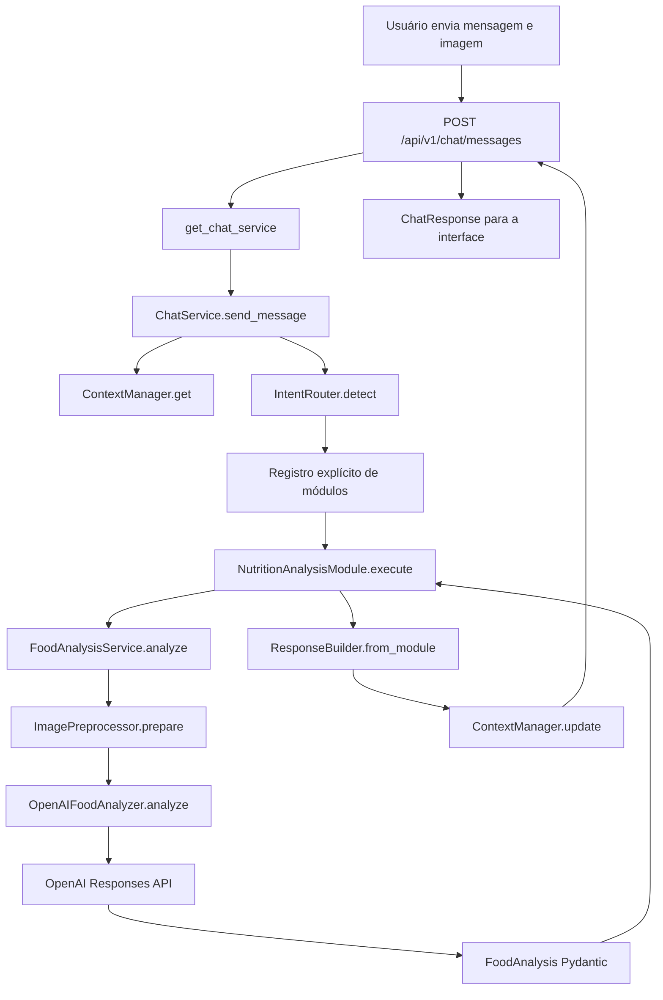
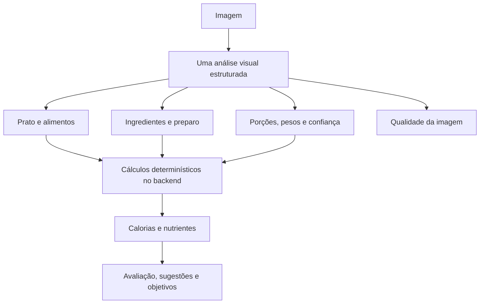

# Fluxo do chat e guia de implementação de módulos

Este documento descreve o backend como ele existe hoje e orienta a evolução
manual de novos módulos. Trechos marcados como **planejados** são propostas de
implementação, não funcionalidades disponíveis.

## 1. Introdução

O Food Vision API é um backend FastAPI que recebe imagens de refeições e devolve
uma análise nutricional estruturada. A integração usa o SDK assíncrono da OpenAI,
entrada multimodal e Structured Outputs validados por modelos Pydantic.

O endpoint único de chat oferece ao frontend um contrato estável para diferentes
intenções. Internamente, um registro explícito relaciona cada intenção a um
módulo funcional. Essa separação permite acrescentar capacidades sem colocar
regras de negócio nas rotas HTTP nem alterar o contrato `ChatResponse`.

Estado atual:

| Capacidade | Estado |
| --- | --- |
| Análise nutricional por imagem | Implementada |
| Contexto de conversa | Mantido apenas em memória |
| Persistência de conversas | Ainda não implementada |
| RAG | Planejado, ainda não implementado |
| Fine-tuning | Planejado, ainda não implementado |

RAG e fine-tuning podem ser incorporados no futuro como implementações
especializadas atrás do mesmo contrato de módulo. Essa possibilidade
arquitetural não significa que essas funcionalidades estejam disponíveis hoje.

## 2. Visão geral da arquitetura

Árvore real relevante:

```text
backend/
├── app/
│   ├── main.py
│   ├── api/
│   │   └── v1/
│   │       ├── router.py
│   │       └── routes/
│   │           ├── chat.py
│   │           ├── food_analysis.py
│   │           └── health.py
│   ├── chat/
│   │   ├── schemas.py
│   │   ├── service.py
│   │   ├── intent_router.py
│   │   ├── context_manager.py
│   │   └── response_builder.py
│   ├── modules/
│   │   ├── nutrition_analysis/
│   │   │   ├── schemas.py
│   │   │   ├── service.py
│   │   │   ├── analyzer.py
│   │   │   └── prompts.py
│   │   ├── food_identification/
│   │   ├── allergen_analysis/
│   │   ├── meal_comparison/
│   │   └── knowledge_rag/
│   ├── integrations/
│   │   └── openai/
│   │       └── client.py
│   ├── services/
│   │   └── image_preprocessor.py
│   ├── dependencies/
│   │   └── services.py
│   └── core/
│       ├── config.py
│       ├── exceptions.py
│       └── logging.py
└── tests/
    ├── integration/
    │   ├── test_chat_endpoint.py
    │   └── test_food_analysis_endpoint.py
    └── unit/
        ├── test_chat_service.py
        ├── test_context_manager.py
        ├── test_food_analysis_service.py
        ├── test_image_preprocessor.py
        ├── test_intent_router.py
        ├── test_openai_food_analyzer.py
        ├── test_response_builder.py
        └── test_schemas.py
```

Os diretórios de módulos futuros contêm somente `__init__.py` vazio.

| Pasta | Responsabilidade |
| --- | --- |
| `app/api` | Entrada HTTP, contratos de transporte e registro de rotas |
| `app/chat` | Orquestração da conversa e contrato comum dos módulos |
| `app/modules` | Casos de uso e integrações específicas de cada domínio |
| `app/integrations` | Construção de clientes externos compartilhados |
| `app/services` | Serviços reutilizáveis por mais de um módulo |
| `app/dependencies` | Construção, cache e encerramento dos objetos |
| `app/core` | Configuração, logging e exceções centrais |
| `tests` | Testes unitários e de integração sem chamadas reais à OpenAI |

## 3. Fluxo completo da aplicação

Exemplo de entrada:

```text
Usuário envia uma imagem e pergunta:
"Quantas calorias existem neste prato?"
```

Sequência real:

| Ordem | Arquivo | Função ou classe | Responsabilidade |
| ---: | --- | --- | --- |
| 1 | `app/main.py` | `create_app` | Configura e instancia o FastAPI |
| 2 | `app/api/v1/router.py` | `api_v1_router` | Agrega chat e endpoint compatível |
| 3 | `app/api/v1/routes/chat.py` | `send_chat_message` | Recebe formulário e fecha o upload |
| 4 | `app/dependencies/services.py` | `get_chat_service` | Resolve o grafo de dependências |
| 5 | `app/chat/service.py` | `ChatService.send_message` | Valida e orquestra a interação |
| 6 | `app/chat/context_manager.py` | `ContextManager.get` | Recupera ou cria o contexto |
| 7 | `app/chat/intent_router.py` | `IntentRouter.detect` | Classifica a intenção |
| 8 | `app/chat/service.py` | registro `modules` | Seleciona implementação registrada |
| 9 | `app/modules/nutrition_analysis/service.py` | `NutritionAnalysisModule.execute` | Adapta o caso nutricional ao chat |
| 10 | mesmo arquivo | `FoodAnalysisService.analyze` | Coordena imagem e analyzer |
| 11 | `app/services/image_preprocessor.py` | `ImagePreprocessor.prepare` | Valida e prepara a imagem |
| 12 | `app/modules/nutrition_analysis/analyzer.py` | `OpenAIFoodAnalyzer.analyze` | Chama `responses.parse` |
| 13 | `app/modules/nutrition_analysis/schemas.py` | `FoodAnalysis` | Valida o Structured Output |
| 14 | `app/chat/response_builder.py` | `ResponseBuilder.from_module` | Constrói `ChatResponse` |
| 15 | `app/chat/context_manager.py` | `ContextManager.update` | Atualiza histórico e estado seguro |
| 16 | `app/api/v1/routes/chat.py` | retorno da rota | Serializa a resposta e fecha o arquivo |

Não há uma segunda chamada à OpenAI para gerar `answer`. O adaptador deriva esse
texto dos dados já validados em `FoodAnalysis`.

## 4. Diagrama do fluxo



## 5. Inicialização da aplicação

O comando:

```powershell
# Inicia o servidor de desenvolvimento e recarrega após alterações.
uv run uvicorn app.main:app --reload
```

importa `app.main`. Durante o import, `app = create_app()`:

1. obtém `Settings` por `get_settings`;
2. configura logging com `configure_logging`;
3. cria a instância `FastAPI`;
4. registra o handler de `ApplicationError`;
5. adiciona o middleware CORS;
6. registra `health_router` sem prefixo;
7. registra `api_v1_router` com o prefixo configurado;
8. associa o lifespan.

O startup do lifespan apenas registra o início. Os objetos são criados sob
demanda pelas factories com `@lru_cache`. Isso inclui o `AsyncOpenAI`; portanto,
o cliente não é aberto antecipadamente apenas por iniciar a aplicação.

No shutdown, `close_services` limpa o contexto, fecha o cliente OpenAI caso tenha
sido criado e limpa os caches das factories. Swagger UI e OpenAPI permanecem nos
caminhos padrão `/docs` e `/openapi.json`. O health check é `GET /health`.

## 6. Versionamento das rotas

`app/api/v1/router.py` agrega somente os routers versionados:

```python
from fastapi import APIRouter

# Importa routers públicos que realmente possuem implementação.
from app.api.v1.routes.chat import router as chat_router
from app.api.v1.routes.food_analysis import router as food_analysis_router

# Centraliza a composição da API v1 sem repetir o prefixo.
api_v1_router = APIRouter()
api_v1_router.include_router(chat_router)
api_v1_router.include_router(food_analysis_router)
```

O prefixo `/api/v1` não está nesse arquivo. Ele é aplicado uma única vez em
`create_app`, por meio de `settings.api_v1_prefix`. Uma nova rota versionada deve
expor um `APIRouter` e ser incluída em `api_v1_router`.

Embora `health.py` esteja fisicamente em `api/v1/routes`, seu router é importado
diretamente por `main.py` e registrado sem prefixo. Assim, o contrato real é
`GET /health`, não `/api/v1/health`.

`POST /api/v1/food-analysis` é o endpoint nutricional anterior e deve ser
preservado durante a evolução do chat.

## 7. Funcionamento do endpoint único de chat

```http
POST /api/v1/chat/messages
Content-Type: multipart/form-data
```

| Campo | Tipo | Obrigatório | Finalidade |
| --- | --- | ---: | --- |
| `message` | texto | Condicional | Pergunta ou instrução |
| `image` | arquivo | Condicional | Imagem da refeição |
| `conversation_id` | texto | Não | Continuidade da conversa |

É obrigatório fornecer `message` ou `image`. A ausência de ambos gera
`EmptyChatMessageError` com status 422. O arquivo é fechado no `finally` da rota,
inclusive quando o serviço lança uma exceção.

Somente imagem:

```powershell
# Envia uma imagem sem texto; a presença da imagem direciona para nutrição.
curl.exe -X POST "http://localhost:8000/api/v1/chat/messages" `
  -F "image=@C:\imagens\prato.jpg"
```

Imagem e pergunta:

```powershell
# Combina a imagem com uma pergunta nutricional.
curl.exe -X POST "http://localhost:8000/api/v1/chat/messages" `
  -F "image=@C:\imagens\prato.jpg" `
  -F "message=Quantas calorias existem neste prato?"
```

Continuação:

```powershell
# Reutiliza um identificador retornado anteriormente.
# Sem imagem, o roteador atual pode responder como intenção desconhecida.
curl.exe -X POST "http://localhost:8000/api/v1/chat/messages" `
  -F "conversation_id=conv_123" `
  -F "message=Qual item possui mais proteína?"
```

O último exemplo documenta o transporte, mas também uma limitação: o roteador
atual não usa o contexto anterior para inferir que uma pergunta textual continua
uma análise nutricional.

## 8. ChatService

`ChatService.send_message` é o coordenador central:

```python
async def send_message(...):
    # 1. Normaliza o texto e exige mensagem ou imagem.
    # 2. Reutiliza ou cria o identificador da conversa.
    # 3. Recupera uma cópia do contexto em memória.
    # 4. Identifica a intenção usando regras determinísticas.
    # 5. Procura a intenção no registro explícito.
    # 6. Executa somente o módulo encontrado.
    # 7. Constrói resposta indisponível quando não há módulo.
    # 8. Atualiza contexto com texto e dados permitidos.
    # 9. Retorna o contrato público ChatResponse.
    ...
```

Quando a intenção existe, mas não está no registro, o builder informa que a
funcionalidade está indisponível. Para `UNKNOWN`, usa a resposta padrão. Em
nenhum desses casos um pacote vazio é importado ou executado.

O `ChatService` não deve chamar OpenAI, processar imagens, calcular nutrientes,
ler `.env`, criar dependências ou conhecer regras internas do módulo.

## 9. IntentRouter

`IntentRouter.detect` normaliza a mensagem removendo espaços, convertendo para
minúsculas e transliterando os caracteres `áàâãéêíóôõúç`. Em seguida:

1. testa, nesta ordem, termos de alérgenos, comparação, RAG e identificação;
2. se nenhum termo casar e houver imagem, retorna `nutrition_analysis` quando
   esse módulo está disponível;
3. caso contrário, retorna `unknown`.

O roteamento não chama OpenAI e ainda não usa `ChatContext`.

| Intenção | Exemplos reconhecidos | Estado |
| --- | --- | --- |
| `nutrition_analysis` | Qualquer entrada com imagem sem termo mais específico | Funcional |
| `food_identification` | "Identifique o alimento" | Planejada, indisponível |
| `allergen_analysis` | "Alergia", "alérgeno" | Planejada, indisponível |
| `meal_comparison` | "Compare", "refeição anterior" | Planejada, indisponível |
| `knowledge_rag` | "Base RAG", "documentos" | Planejada, indisponível |
| `general_chat` | Sem regras atuais | Planejada, indisponível |
| `unknown` | Solicitação não reconhecida | Resposta padrão |

Para adicionar uma intenção futuramente:

```python
# Acrescenta termos normalizados antes do fallback de imagem.
_INTENT_TERMS = (
    (ChatIntent.NEW_INTENT, ("termo principal", "sinonimo")),
    # Mantém as demais regras existentes.
)
```

O teste deve cobrir acentos, sinônimos, precedência com imagem, módulo registrado
e módulo ausente.

## 10. Registro dos módulos

O registro é criado em `get_chat_service`:

```python
# Relaciona cada intenção apenas a uma implementação funcional.
# Pacotes vazios nunca devem aparecer neste dicionário.
modules = {
    ChatIntent.NUTRITION_ANALYSIS: get_nutrition_analysis_module(),
}
```

O registro explícito torna disponibilidade, substituição e testes previsíveis.
Para adicionar um módulo, crie sua factory, injete suas dependências e inclua a
nova associação. Para remover, retire a associação; o roteador ainda pode
classificar a intenção, mas o builder responderá `module="unavailable"`.

Nos testes, uma instância de `ChatService` pode receber um dicionário com stubs.
Em testes HTTP, `app.dependency_overrides[get_chat_service]` substitui o grafo
inteiro sem abrir um cliente OpenAI real.

## 11. ContextManager

O `ContextManager` guarda um `dict[str, ChatContext]` no processo atual e protege
operações concorrentes com `asyncio.Lock`. `get` e `update` retornam cópias
profundas para impedir que consumidores alterem o estado interno sem o lock.

Cada atualização armazena:

- mensagem do usuário ou o marcador `[imagem enviada]`;
- resposta do assistente;
- última intenção;
- último módulo;
- `context_updates` sanitizados.

O limite padrão é 20 mensagens, contando mensagens de usuário e assistente. As
chaves contendo `api_key`, `base64`, `client`, `data_url`, `image` ou `upload`
são removidas recursivamente.

Exemplo compatível com o schema atual:

```json
{
  "conversation_id": "conv_123",
  "messages": [
    {"role": "user", "content": "[imagem enviada]"},
    {"role": "assistant", "content": "Análise nutricional concluída."}
  ],
  "last_intent": "nutrition_analysis",
  "last_module": "nutrition_analysis",
  "state": {
    "last_nutrition_analysis": {}
  }
}
```

O contexto é perdido no restart e não é compartilhado entre workers ou
instâncias. Uma futura implementação com banco ou Redis deve preservar a pequena
interface `get`, `update` e `clear`, além das mesmas regras de segurança. Nenhuma
persistência é implementada nesta etapa.

## 12. ResponseBuilder

O builder separa dados internos do contrato público:

- `ensure_conversation_id` preserva o ID recebido ou gera UUID;
- `from_module` converte `ModuleResult` em `ChatResponse` e gera `message_id`;
- `unavailable` mantém a intenção e informa `module="unavailable"`;
- `unknown` usa intenção `unknown` e resposta padrão.

`answer` contém o texto conversacional. `data` preserva a estrutura específica do
módulo. `suggested_actions` permite ações futuras sem alterar o envelope.

```python
# Converte o resultado interno sem executar lógica de negócio.
response = response_builder.from_module(conversation_id, module_result)
```

## 13. Processamento da imagem

`ImagePreprocessor` é compartilhado porque validações e transformações de upload
podem atender qualquer módulo multimodal.

Sequência real:

1. verifica `UploadFile.content_type`;
2. lê no máximo `max_size_bytes + 1`;
3. rejeita conteúdo vazio ou acima do limite;
4. abre a imagem com Pillow;
5. confirma o formato real JPEG, PNG ou WebP;
6. chama `verify`;
7. reabre e corrige orientação EXIF;
8. converte para RGB;
9. redimensiona proporcionalmente com Lanczos;
10. converte para JPEG com qualidade 85;
11. codifica em Base64 ASCII;
12. constrói `data:image/jpeg;base64,<conteúdo>`.

O trabalho síncrono do Pillow roda em threadpool para não bloquear o event loop.
Warnings de decompression bomb são tratados como imagem inválida. O Data URL
nunca deve ser incluído em logs nem no contexto.

## 14. Integração OpenAI

`app/integrations/openai/client.py` valida a presença da chave e cria um único
`AsyncOpenAI` configurado com timeout e retries. A chave é armazenada por
`SecretStr`, extraída somente na criação do cliente e não registrada em logs.

Responsabilidades:

```text
integrations/openai/client.py
    -> cria e configura o cliente compartilhado

modules/nutrition_analysis/analyzer.py
    -> monta e executa a chamada específica do módulo

modules/nutrition_analysis/prompts.py
    -> mantém a instrução nutricional especializada

modules/nutrition_analysis/schemas.py
    -> define e valida o Structured Output
```

`OpenAIFoodAnalyzer.analyze` monta uma entrada com mensagem de sistema, texto de
usuário e `input_image`. A chamada real é:

```python
# Solicita que o SDK valide a saída diretamente no schema FoodAnalysis.
response = await client.responses.parse(
    model=model,
    input=request_input,
    text_format=FoodAnalysis,
)
```

Se `output_parsed` for `None`, o analyzer gera `InvalidOpenAIResponseError`.
Conexão, timeout e rate limit viram `OpenAIUnavailableError`; erros de status ou
SDK viram `OpenAIServiceError`. O Base64 não aparece nas mensagens de log.

## 15. Resposta estruturada

```text
FoodAnalysis
    -> NutritionAnalysisModule
    -> ModuleResult
    -> ResponseBuilder
    -> ChatResponse
```

`FoodAnalysis` mantém campos nutricionais ricos. O adaptador serializa esse
schema em `ModuleResult.data`, produz `answer` sem nova chamada e solicita a
atualização de `last_nutrition_analysis`. O builder copia apenas o envelope
público.

Exemplo reduzido, coerente com o contrato atual:

```json
{
  "conversation_id": "550e8400-e29b-41d4-a716-446655440000",
  "message_id": "6ba7b810-9dad-11d1-80b4-00c04fd430c8",
  "role": "assistant",
  "answer": "Prato com arroz e frango: estimativa total de 650 kcal.",
  "intent": "nutrition_analysis",
  "module": "nutrition_analysis",
  "data": {
    "dish_name": "Prato com arroz e frango",
    "total_nutrition": {
      "calories": 650
    }
  },
  "suggested_actions": []
}
```

# Como implementar novos módulos

Um módulo deve representar uma capacidade coesa, não cada campo de resposta.
Antes de criar arquivos, verifique se o schema e a chamada multimodal atuais já
produzem a informação. A extensão preferida é adaptar ou enriquecer um módulo
existente quando isso evita outra análise da mesma imagem.

## Estrutura padrão de um módulo

Estrutura de referência, não um requisito para todos os casos:

```text
app/modules/<module_name>/
├── __init__.py
├── schemas.py
├── prompts.py
├── analyzer.py
├── service.py
└── adapter.py
```

| Arquivo | Responsabilidade | Quando é necessário |
| --- | --- | --- |
| `schemas.py` | Modelos Pydantic específicos | Quando há dados estruturados próprios |
| `prompts.py` | Instruções especializadas | Quando o módulo chama uma LLM |
| `analyzer.py` | Comunicação com a OpenAI | Quando existe análise por modelo |
| `service.py` | Orquestração do caso de uso | Quando há etapas ou regras de negócio |
| `adapter.py` | Conversão para `ModuleResult` | Quando o service não implementa o contrato do chat |
| `__init__.py` | Declaração do pacote | Sempre |

Um módulo determinístico não precisa de `prompts.py` ou `analyzer.py`. O módulo
nutricional atual mantém service e adapter no mesmo `service.py`; não é
necessário separá-los apenas para seguir esta árvore.

## Passos universais

### 1. Definir a intenção

Adicione o valor ao `ChatIntent` somente quando houver implementação:

```python
class ChatIntent(StrEnum):
    # Identificador estável que será exposto no contrato do chat.
    NEW_CAPABILITY = "new_capability"
```

### 2. Criar o pacote e escolher responsabilidades

Crie apenas os arquivos utilizados. Não adicione analyzer quando um cálculo
determinístico sobre dados já existentes resolver o caso.

### 3. Definir schemas

```python
from pydantic import BaseModel, ConfigDict, Field


class NewCapabilityResult(BaseModel):
    # Rejeita campos inesperados para detectar mudanças de contrato.
    model_config = ConfigDict(extra="forbid")

    summary: str
    confidence: float = Field(ge=0, le=1)
```

Schemas devem representar incerteza com campos opcionais, faixas e confiança,
sem converter estimativas em certezas.

### 4. Criar o prompt, se necessário

```python
# Mantém instruções de domínio junto ao módulo que as utiliza.
NEW_CAPABILITY_SYSTEM_PROMPT = """
Retorne somente informações suportadas pela entrada.
Use null quando não houver evidência suficiente.
"""
```

Teste regras obrigatórias como texto local; não chame a API para testar prompt.

### 5. Criar o analyzer, se necessário

```python
class NewCapabilityAnalyzer:
    def __init__(self, client: AsyncOpenAI, model: str) -> None:
        # Reutiliza o cliente compartilhado criado pela composição.
        self.client = client
        self.model = model

    async def analyze(self, prepared: PreparedImage) -> NewCapabilityResult:
        # Structured Outputs valida a resposta no schema do módulo.
        response = await self.client.responses.parse(
            model=self.model,
            input=build_input(prepared),
            text_format=NewCapabilityResult,
        )
        ...
```

Reutilize a política de erros do analyzer nutricional e nunca registre o Data
URL, prompt completo com dados sensíveis ou chave.

### 6. Criar service e adapter

```python
class NewCapabilityModule:
    async def execute(
        self,
        *,
        message: str | None,
        image: UploadFile | None,
        context: ChatContext,
    ) -> ModuleResult:
        # Obtém o resultado específico sem expor detalhes ao ChatService.
        result = await self.service.execute(image=image, context=context)

        # Converte o domínio para o envelope interno comum.
        return ModuleResult(
            answer=build_answer(result),
            intent=ChatIntent.NEW_CAPABILITY,
            module=ChatIntent.NEW_CAPABILITY.value,
            data=result.model_dump(mode="json"),
            context_updates={"last_new_capability": result.model_dump(mode="json")},
        )
```

O método deve respeitar o protocolo `ChatModule`. Não altere o `ChatService` para
conhecer parâmetros internos do novo módulo.

### 7. Registrar dependências

```python
@lru_cache
def get_new_capability_module() -> NewCapabilityModule:
    # A factory é o composition root da implementação.
    return NewCapabilityModule(
        service=get_new_capability_service(),
    )
```

Inclua limpeza de cache em `close_services` quando a factory usa `lru_cache`.
Recursos externos também precisam de encerramento explícito.

### 8. Registrar o módulo no chat

```python
def get_chat_service() -> ChatService:
    return ChatService(
        intent_router=get_intent_router(),
        context_manager=get_context_manager(),
        response_builder=get_response_builder(),
        # Somente implementações prontas e testadas entram no registro.
        modules={
            ChatIntent.NUTRITION_ANALYSIS: get_nutrition_analysis_module(),
            ChatIntent.NEW_CAPABILITY: get_new_capability_module(),
        },
    )
```

O registro, não a existência do pacote, define disponibilidade.

### 9. Atualizar o IntentRouter

```python
_INTENT_TERMS = (
    # Termos devem estar normalizados e possuir testes de precedência.
    (ChatIntent.NEW_CAPABILITY, ("novo termo", "sinonimo")),
    # Mantém regras mais específicas antes do fallback por imagem.
    *_INTENT_TERMS,
)
```

Evite termos genéricos que desviem perguntas nutricionais. Se o contexto passar a
influenciar a classificação, altere a assinatura e os testes de forma explícita;
hoje ele não participa de `detect`.

### 10. Atualizar contexto e resposta

Armazene somente o mínimo necessário para continuação ou cálculo. Não armazene
uploads, Base64, clientes, chaves ou objetos não serializáveis. O adapter deve
derivar `answer` do resultado existente, evitando uma chamada apenas para
redação.

### 11. Criar testes

Cubra schema, analyzer com mock, service, adapter, roteamento, registro e
endpoint. Use `dependency_overrides` para impedir chamadas externas.

### 12. Validar, documentar e commitar

```powershell
# Executa os mesmos gates usados pelo backend.
uv run ruff check .
uv run ruff format --check .
uv run mypy app
uv run pytest

# Verifica somente o conteúdo selecionado antes do commit.
git diff --cached --check
```

Use um commit semântico para a capacidade completa, não um commit por arquivo.

# Funcionalidades planejadas

As seções abaixo diferenciam o que o schema atual já fornece do que ainda exige
implementação. Campos "recomendados" não existem em produção até que um projeto
futuro os implemente.

## 1. Reconhecimento do prato por imagem

| Aspecto | Orientação |
| --- | --- |
| Estado e objetivo | `FoodAnalysis.dish_name` já retorna o nome provável do prato; uma evolução pode melhorar ambiguidade sem criar endpoint |
| Intenção e módulo | Continuar em `nutrition_analysis` ou consolidar futuramente em `food_vision`; não criar módulo só para um campo |
| Arquivos e schema | Evoluir `schemas.py`, prompt e testes; recomendar `dish_name`, alternativas e confiança |
| Prompt e fluxo | Uma única análise visual distingue prato composto de alimentos individuais |
| Contexto e continuação | Guardar nome e alternativas; perguntar região ou preparo quando ambíguo |
| Incerteza e riscos | Não afirmar prato regional, marca ou receita sem evidência |
| Testes e commit | Pratos simples, compostos e ambíguos; `feat(vision): improve dish recognition confidence` |

## 2. Identificação dos alimentos presentes

| Aspecto | Orientação |
| --- | --- |
| Estado e objetivo | `FoodAnalysis.components` já representa itens do prato, mas não existe schema dedicado `foods` |
| Intenção e módulo | `food_identification`; pacote existe vazio e não está registrado |
| Arquivos e schema | Criar implementação no pacote somente quando aprovada; `foods[{name, confidence}]` |
| Prompt e fluxo | Reutilizar a mesma percepção do prato e separar cada alimento observável |
| Contexto e continuação | Guardar lista normalizada; permitir "qual deles..." |
| Incerteza e riscos | Alimentos sobrepostos ou cobertos podem ser confundidos |
| Testes e commit | Vários itens, prato homogêneo e ausência de alimento; `feat(food-identification): identify visible foods` |

## 3. Identificação de ingredientes visíveis

| Aspecto | Orientação |
| --- | --- |
| Estado e objetivo | Já existe `IngredientEstimate` com `detection_type="visible"` |
| Intenção e módulo | Parte da análise visual nutricional; não requer intenção isolada |
| Arquivos e schema | Preservar `ingredients`; opcionalmente acrescentar evidência visual em versão futura |
| Prompt e fluxo | Incluir apenas itens observáveis e aproveitar a chamada multimodal atual |
| Contexto e continuação | Guardar por componente; perguntar qual ingrediente o usuário deseja revisar |
| Incerteza e riscos | Molhos e misturas não permitem decomposição visual confiável |
| Testes e commit | Ingredientes claros versus ocultos; `feat(nutrition): improve visible ingredient evidence` |

## 4. Inferência de ingredientes ocultos

| Aspecto | Orientação |
| --- | --- |
| Estado e objetivo | O schema diferencia `visible` e `inferred`; ainda não possui `unknown` |
| Intenção e módulo | Permanecer em `nutrition_analysis` |
| Arquivos e schema | Avaliar `DetectionType.UNKNOWN` somente com migração de contrato; registrar motivo da inferência |
| Prompt e fluxo | Inferir apenas componentes plausíveis após a percepção visual |
| Contexto e continuação | Guardar status e permitir confirmação do usuário |
| Incerteza e riscos | Óleo, sal, açúcar e farinha nunca devem ser apresentados como certeza visual |
| Testes e commit | Inferido, visível e insuficiente; `feat(nutrition): model hidden ingredient uncertainty` |

## 5. Estimativa do tamanho das porções

| Aspecto | Orientação |
| --- | --- |
| Estado e objetivo | `estimated_portion` existe como texto, sem faixa estruturada |
| Intenção e módulo | `nutrition_analysis` ou futuro agrupamento `portion_estimation` |
| Arquivos e schema | Recomendar unidade, descrição, mínimo, máximo e confiança |
| Prompt e fluxo | Estimar pequena, média, grande, unidade, colher, xícara, fatia ou filé na análise visual |
| Contexto e continuação | Guardar por componente; perguntar dimensão do prato como referência |
| Incerteza e riscos | Perspectiva e ausência de escala aumentam a faixa |
| Testes e commit | Escala conhecida e desconhecida; `feat(portions): add structured portion ranges` |

## 6. Estimativa do peso dos alimentos

| Aspecto | Orientação |
| --- | --- |
| Estado e objetivo | `estimated_weight_g` fornece valor único opcional |
| Intenção e módulo | Evolução de `nutrition_analysis` ou `portion_estimation` |
| Arquivos e schema | Recomendar `estimated_g`, `min_g`, `max_g`, `confidence`, `reasoning_summary` |
| Prompt e fluxo | Derivar peso da porção e referências visuais, sem precisão falsa |
| Contexto e continuação | Guardar faixa por alimento; aceitar peso informado pelo usuário |
| Incerteza e riscos | Densidade, oclusão e profundidade não são observáveis com precisão |
| Testes e commit | Faixas coerentes e valores não negativos; `feat(portions): estimate food weight ranges` |

## 7. Estimativa de calorias

| Aspecto | Orientação |
| --- | --- |
| Estado e objetivo | Calorias já são estimadas pelo Structured Output atual |
| Intenção e módulo | `nutrition_analysis` |
| Arquivos e schema | Preservar campos públicos; futuramente separar fonte por 100 g e cálculo |
| Prompt e fluxo | Reconhecimento visual -> peso -> referência nutricional -> total |
| Contexto e continuação | Guardar valores por componente e total |
| Incerteza e riscos | Óleos, molhos e preparo alteram significativamente o resultado |
| Testes e commit | Soma, faixa e validações Pydantic; `feat(nutrition): calculate calories from reference data` |

Uma implementação com base nutricional deve calcular no backend, não pedir à LLM
que faça aritmética.

## 8. Proteínas, carboidratos e gorduras

| Aspecto | Orientação |
| --- | --- |
| Estado e objetivo | Os três campos já existem em `NutritionEstimate` como estimativas |
| Intenção e módulo | `nutrition_analysis` |
| Arquivos e schema | Manter valor por componente e total; adicionar fonte e faixa apenas com versionamento adequado |
| Prompt e fluxo | Futuro cálculo determinístico após peso e dados por 100 g |
| Contexto e continuação | Guardar totais e permitir pergunta por componente |
| Incerteza e riscos | O valor visual não substitui composição de uma base confiável |
| Testes e commit | Cálculo, arredondamento e soma; `feat(nutrition): derive macros from food weights` |

Fórmula futura: `nutriente_estimado = nutriente_por_100g ×
peso_estimado_g ÷ 100`.

## 9. Fibras, açúcar e sódio

| Aspecto | Orientação |
| --- | --- |
| Estado e objetivo | Campos opcionais já existem, mas são estimados pelo modelo |
| Intenção e módulo | `nutrition_analysis` |
| Arquivos e schema | Associar valor, faixa, fonte e confiança quando houver base |
| Prompt e fluxo | Visão identifica alimento; backend consulta composição e calcula |
| Contexto e continuação | Guardar valores por alimento e total |
| Incerteza e riscos | Açúcar adicionado e sódio são pouco inferíveis visualmente |
| Testes e commit | Dados ausentes, receitas e agregação; `feat(nutrition): enrich micronutrient estimates` |

## 10. Faixa mínima e máxima de calorias

| Aspecto | Orientação |
| --- | --- |
| Estado e objetivo | `total_calorie_range.min/max` já existe e valida ordem |
| Intenção e módulo | `nutrition_analysis` |
| Arquivos e schema | Futuro cálculo usa peso mínimo/máximo e cenários de preparo |
| Prompt e fluxo | Combinar pesos, óleos, molhos, recheios e ingredientes incertos |
| Contexto e continuação | Guardar premissas que explicam a amplitude |
| Incerteza e riscos | Faixa estreita sem escala ou receita é enganosa |
| Testes e commit | Limites, cenários e total dentro da faixa; `feat(nutrition): calculate calorie uncertainty ranges` |

## 11. Nível de confiança por alimento

| Aspecto | Orientação |
| --- | --- |
| Estado e objetivo | Há confiança geral, por componente e ingrediente, mas não por dimensão |
| Intenção e módulo | Compartilhado pela análise visual |
| Arquivos e schema | Recomendar confiança de identificação, porção, peso, preparo, ingredientes e nutrição |
| Prompt e fluxo | Cada etapa produz sua própria confiança; não reutilizar um único valor |
| Contexto e continuação | Guardar dimensões de baixa confiança para perguntas |
| Incerteza e riscos | Confiança textual não é probabilidade calibrada |
| Testes e commit | Dimensões independentes e enum válido; `feat(vision): add confidence dimensions` |

## 12. Detecção da qualidade da imagem

| Aspecto | Orientação |
| --- | --- |
| Estado e objetivo | Não implementada; Pillow valida arquivo, não qualidade semântica |
| Intenção e módulo | Futuro `food_vision`, compartilhado antes da análise |
| Arquivos e schema | `ImageQuality{blur, lighting, framing, occlusion, distance, overlap, has_food, resolution, usable}` |
| Prompt e fluxo | Pode compartilhar a chamada visual; checks técnicos simples podem ser determinísticos |
| Contexto e continuação | Guardar motivos de baixa qualidade |
| Incerteza e riscos | Heurísticas locais e avaliação da LLM possuem escalas diferentes |
| Testes e commit | Desfoque, escuro, sem alimento e válido; `feat(vision): assess meal image quality` |

## 13. Solicitação de uma nova foto

| Aspecto | Orientação |
| --- | --- |
| Estado e objetivo | Há `requires_user_confirmation` e `follow_up_questions`, mas não uma política de nova foto |
| Intenção e módulo | Resultado de `food_vision`, não intenção isolada |
| Arquivos e schema | Usar qualidade, motivo e instruções específicas |
| Prompt e fluxo | Se imagem não utilizável, não calcular nutrição e pedir nova foto |
| Contexto e continuação | Guardar solicitação pendente até novo upload |
| Incerteza e riscos | Não pedir nova imagem quando uma pergunta textual bastar |
| Testes e commit | Vista superior, aproximação e iluminação; `feat(vision): request better meal images` |

Respostas devem ser acionáveis: "Envie uma foto vista de cima", "Aproxime a
câmera", "Melhore a iluminação" ou "Fotografe cada prato separadamente".

## 14. Perguntas para melhorar a precisão

| Aspecto | Orientação |
| --- | --- |
| Estado e objetivo | `follow_up_questions` já existe |
| Intenção e módulo | Gerada pelo módulo responsável pela lacuna |
| Arquivos e schema | Preservar lista e opcionalmente associar cada pergunta a um campo |
| Prompt e fluxo | Perguntar preparo, óleo, tamanho, recheio, peso ou composição do molho |
| Contexto e continuação | Guardar perguntas pendentes e respostas do usuário |
| Incerteza e riscos | Limitar quantidade e evitar perguntas sem impacto no resultado |
| Testes e commit | Priorização e deduplicação; `feat(chat): track nutrition clarification questions` |

## 15. Correção manual dos alimentos

| Aspecto | Orientação |
| --- | --- |
| Estado e objetivo | Não implementada; exemplo: "Não era frango. Era peixe." |
| Intenção e módulo | Nova intenção de correção em futuro `analysis_correction` |
| Arquivos e schema | `FoodCorrection{component_id, previous_name, corrected_name}` |
| Prompt e fluxo | Interpretar correção -> validar alvo -> atualizar estado -> recalcular |
| Contexto e continuação | Preservar original, correção e histórico |
| Incerteza e riscos | Nomes duplicados exigem desambiguação |
| Testes e commit | Alvo único, ambíguo e inexistente; `feat(corrections): support food corrections` |

## 16. Correção manual das quantidades

| Aspecto | Orientação |
| --- | --- |
| Estado e objetivo | Não implementada; deve alterar apenas o componente citado |
| Intenção e módulo | `analysis_correction` |
| Arquivos e schema | `QuantityCorrection{component_id, value, unit, normalized_g}` |
| Prompt e fluxo | Extrair quantidade -> normalizar unidade -> atualizar componente |
| Contexto e continuação | Guardar valor anterior e corrigido |
| Incerteza e riscos | Conversão de unidade depende do alimento e densidade |
| Testes e commit | Gramas, unidades e componente ambíguo; `feat(corrections): support quantity corrections` |

## 17. Recálculo após correções

| Aspecto | Orientação |
| --- | --- |
| Estado e objetivo | Não implementado; deve evitar nova visão quando a imagem não mudou |
| Intenção e módulo | Operação determinística de `analysis_correction` e nutrição |
| Arquivos e schema | Resultado recalculado com referência à revisão anterior |
| Prompt e fluxo | Correção -> contexto -> recálculo backend -> nova resposta |
| Contexto e continuação | Versionar resultados e manter dado corrigido como fonte |
| Incerteza e riscos | Recalcular todos os totais afetados sem mutar histórico |
| Testes e commit | Uma correção, múltiplas e rollback lógico; `feat(corrections): recalculate nutrition after edits` |

## 18. Avaliação do equilíbrio nutricional

| Aspecto | Orientação |
| --- | --- |
| Estado e objetivo | Não implementada; avaliação informativa, nunca diagnóstico |
| Intenção e módulo | Futuro `meal_evaluation` |
| Arquivos e schema | Proteínas, carboidratos, gorduras, vegetais, fibras, variedade e densidade |
| Prompt e fluxo | Consumir análise validada; preferir regras transparentes |
| Contexto e continuação | Guardar critérios e permitir "por quê?" |
| Incerteza e riscos | Uma foto não representa dieta, condição clínica ou necessidade individual |
| Testes e commit | Perfis de refeição e linguagem segura; `feat(meal-evaluation): assess meal balance` |

## 19. Identificação de possíveis alérgenos

| Aspecto | Orientação |
| --- | --- |
| Estado e objetivo | Não implementada; pacote vazio e intenção reconhecida como indisponível |
| Intenção e módulo | `allergen_analysis` |
| Arquivos e schema | Possível alérgeno, evidência, origem visível/inferida, confiança e avisos |
| Prompt e fluxo | Usar alimentos e ingredientes; tratar leite, ovos, trigo, soja, amendoim, castanhas, peixes e crustáceos |
| Contexto e continuação | Perguntar receita, rótulo e contaminação cruzada |
| Incerteza e riscos | Imagem não confirma ausência; ingredientes ocultos não são validáveis; resultado não garante segurança alimentar |
| Testes e commit | Avisos obrigatórios e nunca afirmar "livre de"; `feat(allergens): report possible food allergens` |

## 20. Identificação do método de preparo

| Aspecto | Orientação |
| --- | --- |
| Estado e objetivo | Não há campo explícito; descrições atuais podem conter inferências não estruturadas |
| Intenção e módulo | Parte de futuro `food_vision` |
| Arquivos e schema | Enum frito, assado, grelhado, cozido, refogado, cru, empanado, vapor e desconhecido |
| Prompt e fluxo | Inferir na chamada visual e permitir confirmação |
| Contexto e continuação | Guardar por componente |
| Incerteza e riscos | Métodos visualmente semelhantes exigem `unknown` |
| Testes e commit | Métodos claros e ambíguos; `feat(vision): classify cooking methods` |

## 21. Sugestões de substituições

| Aspecto | Orientação |
| --- | --- |
| Estado e objetivo | Não implementada; informar alternativas sem prescrição médica |
| Intenção e módulo | `meal_evaluation` |
| Arquivos e schema | Item original, substituto, justificativa, efeito esperado e confiança |
| Prompt e fluxo | Consumir prato e objetivo; não repetir visão |
| Contexto e continuação | Guardar sugestões aceitas ou rejeitadas |
| Incerteza e riscos | Respeitar preferências, alergias conhecidas e disponibilidade sem assumir condições clínicas |
| Testes e commit | Frita por assada, molho leve e opção integral; `feat(meal-evaluation): suggest food substitutions` |

## 22. Sugestões para reduzir calorias

| Aspecto | Orientação |
| --- | --- |
| Estado e objetivo | Não implementada; cada sugestão precisa justificar a faixa estimada |
| Intenção e módulo | `meal_evaluation` |
| Arquivos e schema | Mudança, justificativa, redução mínima/máxima e confiança |
| Prompt e fluxo | Aplicar cenário sobre dados atuais; cálculo no backend quando possível |
| Contexto e continuação | Guardar cenário, não substituir análise original |
| Incerteza e riscos | Não prometer redução exata nem recomendar restrição extrema |
| Testes e commit | Faixas coerentes e linguagem segura; `feat(meal-evaluation): suggest lower-calorie options` |

## 23. Sugestões para aumentar proteínas ou fibras

| Aspecto | Orientação |
| --- | --- |
| Estado e objetivo | Não implementada; sugestões devem considerar o prato identificado |
| Intenção e módulo | `meal_evaluation` |
| Arquivos e schema | Nutriente alvo, adição/substituição, quantidade e impacto estimado |
| Prompt e fluxo | Reutilizar análise e base nutricional, sem nova visão |
| Contexto e continuação | Guardar alvo informado pelo usuário |
| Incerteza e riscos | Não fornecer recomendação médica personalizada |
| Testes e commit | Pratos com e sem opções coerentes; `feat(meal-evaluation): suggest protein and fiber improvements` |

## 24. Adequação a objetivos alimentares

| Aspecto | Orientação |
| --- | --- |
| Estado e objetivo | Não implementada; objetivos são preferências informativas |
| Intenção e módulo | `meal_evaluation` |
| Arquivos e schema | Objetivo, avaliação, ajustes possíveis, limitações e avisos |
| Prompt e fluxo | Avaliar redução calórica, proteínas, fibras, sódio, vegetariano, pré ou pós-treino |
| Contexto e continuação | Guardar objetivo somente com consentimento e escopo da conversa |
| Incerteza e riscos | Objetivos clínicos devem ser tratados por profissional habilitado |
| Testes e commit | Cada objetivo e conflitos entre objetivos; `feat(meal-evaluation): assess meal goals` |

# Agrupamento recomendado em módulos

O agrupamento futuro deve ser incremental e preservar `nutrition_analysis`
enquanto seu contrato público estiver em uso:

```text
modules/
├── food_vision/              # Proposta futura
│   ├── prato, alimentos e ingredientes
│   ├── método de preparo
│   └── qualidade da imagem
├── portion_estimation/       # Proposta futura
│   └── porção e peso
├── nutrition_analysis/       # Implementado hoje
│   └── calorias, nutrientes e faixa calórica
├── analysis_correction/      # Proposta futura
│   └── correções e recálculo
├── meal_evaluation/          # Proposta futura
│   └── equilíbrio, sugestões e objetivos
└── allergen_analysis/        # Pacote vazio hoje
    └── possíveis alérgenos
```

`food_identification` já existe como pacote vazio. Antes de criar `food_vision`,
decida se ele será evoluído/renomeado ou se a percepção continuará dentro de
`nutrition_analysis`. Evite manter dois módulos responsáveis pela mesma análise
visual.

## Evitar chamadas desnecessárias

Arquitetura recomendada:



Não execute uma chamada por campo. A percepção visual pode produzir prato,
alimentos, ingredientes, preparo, porções, pesos, confiança e qualidade em uma
estrutura. Calorias e nutrientes devem migrar para cálculos baseados em dados
quando uma fonte nutricional for integrada. Avaliações consomem esses resultados
sem reenviar a imagem.

# Estratégia de testes

| Área | Teste mínimo |
| --- | --- |
| Schemas | Campos obrigatórios, limites, extras e combinações inválidas |
| Prompts | Presença de regras críticas, sem chamada externa |
| Analyzer | `responses.parse` com `AsyncMock`, parsed output e exceções |
| Service | Ordem de chamadas e regras determinísticas |
| Adapter | Conversão para `ModuleResult` e `context_updates` seguros |
| IntentRouter | Termos, acentos, precedência, imagem e indisponibilidade |
| ContextManager | limite, cópia, sanitização, clear e concorrência |
| ChatService | módulo registrado, ausente, ID e atualização de contexto |
| Endpoint | multipart, 422, fechamento do upload e contrato |
| Regressão | `/health`, `/food-analysis` e schemas existentes |
| Correção manual | alvo, unidade, recálculo e histórico |
| Indisponibilidade | pacote vazio nunca executado nem registrado |

Analyzer com mock:

```python
@pytest.mark.asyncio
async def test_analyzer_uses_structured_output() -> None:
    # Evita rede e controla a resposta do SDK.
    client = AsyncMock()
    client.responses.parse.return_value.output_parsed = expected

    result = await analyzer.analyze(prepared_image)

    # Confirma que o schema validado é retornado.
    assert result == expected
```

Endpoint com override:

```python
@pytest.mark.asyncio
async def test_chat_uses_overridden_service() -> None:
    # Substitui toda a composição para impedir uma chamada real.
    app.dependency_overrides[get_chat_service] = lambda: stub_service

    response = await client.post(
        "/api/v1/chat/messages",
        files={"image": ("food.jpg", b"image", "image/jpeg")},
    )

    # Verifica apenas o contrato público do endpoint.
    assert response.status_code == 200
```

Nenhum teste automatizado deve depender de uma chave real da OpenAI.

# Checklist de novo módulo

- [ ] Definir a intenção
- [ ] Confirmar que a capacidade não existe em outro módulo
- [ ] Criar somente os arquivos necessários
- [ ] Criar os schemas
- [ ] Criar o prompt, quando houver LLM
- [ ] Criar o analyzer, quando houver integração externa
- [ ] Criar o service
- [ ] Criar o adapter, quando necessário
- [ ] Criar apenas as exceções necessárias
- [ ] Registrar as dependências
- [ ] Registrar o módulo
- [ ] Atualizar o `IntentRouter`
- [ ] Atualizar o contexto com dados mínimos
- [ ] Criar testes unitários
- [ ] Criar testes de integração
- [ ] Atualizar a documentação
- [ ] Executar Ruff
- [ ] Executar Mypy
- [ ] Executar Pytest
- [ ] Criar commit semântico

# Roadmap recomendado

## Fase 1 - Visão

Reconhecimento do prato, alimentos, ingredientes visíveis/inferidos, preparo,
qualidade, confiança, nova foto e perguntas. Parte desses dados já existe no
schema nutricional; a fase começa por medir lacunas e evitar regressão.

## Fase 2 - Porções e nutrição

Faixas de porção/peso, calorias, macros, fibras, açúcar, sódio e faixas. Depende
de uma percepção visual consistente e, idealmente, de uma fonte nutricional
versionada.

## Fase 3 - Correções

Correção de alimento, quantidade e recálculo. Depende de identificadores estáveis
por componente, estado versionado e cálculos separáveis da chamada visual.

## Fase 4 - Avaliação

Equilíbrio, alérgenos, substituições, redução calórica, proteínas, fibras e
objetivos. Depende de dados nutricionais confiáveis e de políticas de segurança.

# Princípios arquiteturais

- **Separação de responsabilidades:** rotas transportam, chat coordena, módulos
  executam e integrações conectam recursos externos.
- **Open/Closed:** uma nova implementação entra pelo protocolo e registro, sem
  branches específicos no `ChatService`.
- **Dependency Inversion:** o chat depende de `ChatModule`, não de analyzers.
- **Interfaces pequenas:** `execute`, `get`, `update`, `clear` e factories
  explícitas facilitam substituição.
- **Schemas por domínio:** dados específicos ficam no módulo; `ChatResponse`
  permanece estável.
- **Recursos compartilhados:** cliente OpenAI e preprocessador são reutilizados.
- **Cálculos determinísticos:** aritmética e agregação devem sair da LLM quando
  houver dados de referência.
- **Uma percepção por imagem:** evite duplicação de prompts e chamadas.
- **Compatibilidade:** preserve `/api/v1/food-analysis` e schemas publicados.
- **Testabilidade:** registro e dependency overrides isolam rede e filesystem.
- **Observabilidade:** registre IDs e estágios, nunca chave, Base64 ou conteúdo
  sensível.
- **Segurança:** limite uploads, sanitize contexto e mantenha linguagem segura.
- **Evolução para RAG:** um futuro módulo pode seguir o mesmo protocolo, mas
  requer fonte, indexação, autorização e avaliação antes de ser registrado.

# Validação antes de integrar um módulo

1. Confirme que todos os caminhos novos existem.
2. Diferencie arquivos atuais de propostas.
3. Confirme nomes de classes e métodos no código.
4. Preserve `/health`, `/api/v1/food-analysis` e `/api/v1/chat/messages`.
5. Compare exemplos com `ModuleResult`, `ChatResponse` e schema do módulo.
6. Não registre pacotes vazios.
7. Marque RAG, fine-tuning e persistência como futuros.
8. Revise se o diagrama representa o fluxo real.
9. Garanta que não existe segunda chamada desnecessária.
10. Execute lint, formatação, tipagem e testes.
